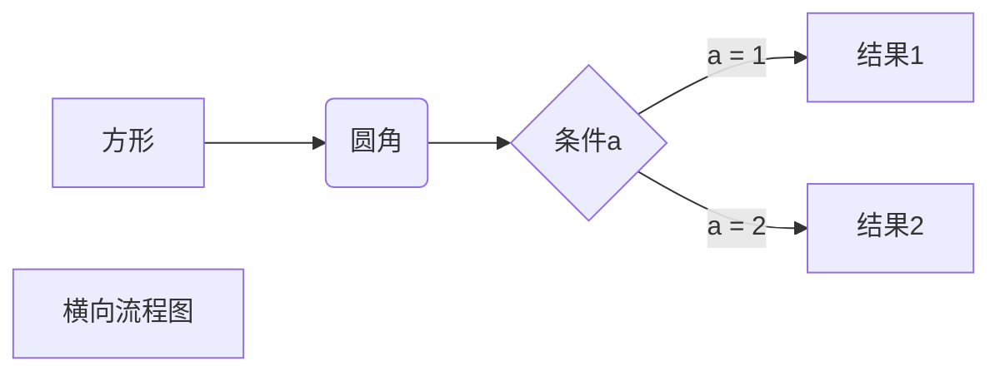
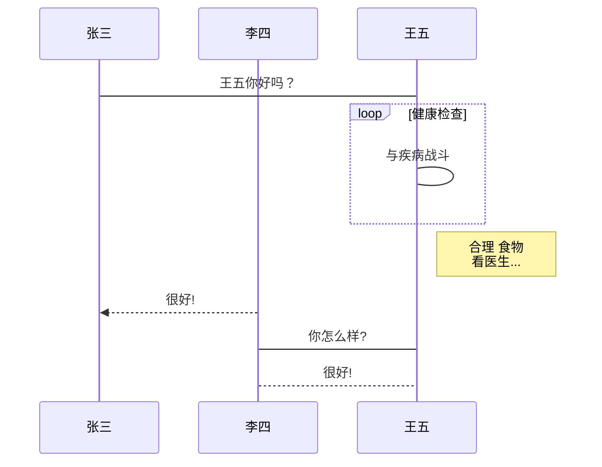
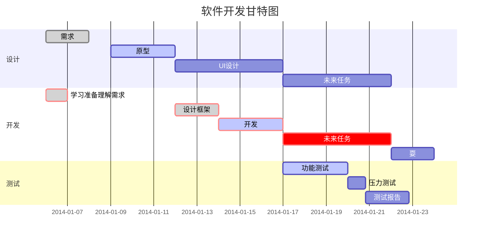
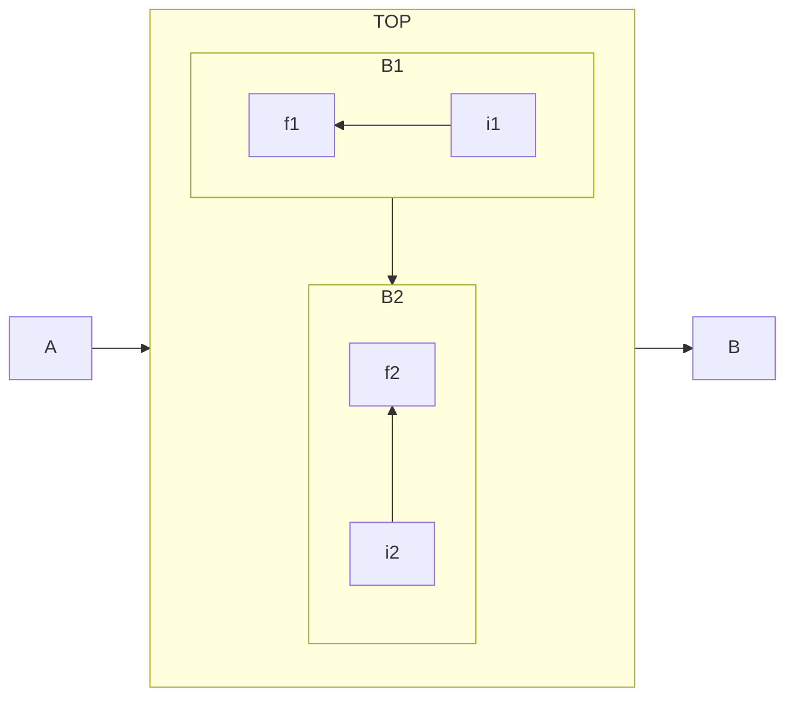

# 基础语法

## 标题

在Markdown中使用：# 行表示标题语法，#号的个数表示标题的级别，且最多只能创建到6级，例如：

| Markdown语法  | HTML          |
|-------------|---------------|
| # 一级标题      | <h1>一级标题</h1> |
| ## 二级标题     | <h1>二级标题</h1> |
| ### 三级标题    | <h1>三级标题</h1> |
| #### 四级标题   | <h1>四级标题</h1> |
| ##### 五级标题  | <h1>五级标题</h1> |
| ###### 六级标题 | <h1>六级标题</h1> |

或者可以在文本下方添加任意数量的：== 号来标识一级标题，或者：-- 号来标识二级标题，例如：

| Markdown语法    | HTML          |
|---------------|---------------|
| ======== 一级标题 | <h1>一级标题</h1> |
| -------- 二级标题 | <h1>二级标题</h1> |

## 段落

使用空白行将一行或多行文本进行分隔，但不要用空格（spaces）或制表符（ tabs）缩进段落，例如：

| Markdown语法                                                                                  | HTML                                                                                                       |
|---------------------------------------------------------------------------------------------|------------------------------------------------------------------------------------------------------------|
| I really like using Markdown.I think I'll use it to format all of my documents from now on. | <p>I really like using Markdown.</p> <p>I think I'll use it to format all of my documents from now on.</p> |

## 换行

在一行的末尾添加两个及以上空格，然后按回车键,即可创建一个换行：<br/>，例如：

| Markdown语法                                                                                       | HTML                                                                                                       |
|--------------------------------------------------------------------------------------------------|------------------------------------------------------------------------------------------------------------|
| I really like using Markdown.<br/>I think I'll use it to format all of my documents from now on. | <p>I really like using Markdown.</p> <p>I think I'll use it to format all of my documents from now on.</p> |

## 段落修饰

### 斜体

要用斜体显示文本，请在单词或短语前后添加一个星号（asterisk 推荐使用）或下划线（underscore）。要斜体突出单词的中间部分，请在字母前后各添加一个星号，中间不要带空格，例如：

| Markdown语法 | HTML                                       |
|------------|--------------------------------------------|
| 这是一个*斜体*词语 | Italicized text is the<em>cat's meow</em>. |
| 这是一段_斜体段落_ | Italicized text is the<em>cat's meow</em>. |

### 粗体

要加粗文本，请在单词或短语的前后各添加两个星号：**（asterisks 推荐使用）或下划线:__
（underscores）。如需加粗一个单词或短语的中间部分用以表示强调的话，请在要加粗部分的两侧各添加两个星号（asterisks），例如：

| Markdown语法   | HTML                                   |
|--------------|----------------------------------------|
| 这是一个**粗体**词语 | I just love<strong>bold text</strong>. |
| 这是一段__粗体段落__ | I just love<strong>bold text</strong>. |

### 粗体和斜体

要同时用粗体和斜体突出显示文本，请在单词或短语的前后各添加三个星号或下划线。要加粗并用斜体显示单词或短语的中间部分，请在要突出显示的部分前后各添加三个星号，中间不要带空格，例如：

| Markdown语法        | HTML                                                    |
|-------------------|---------------------------------------------------------|
| 这是一个***粗体和斜体***词语 | This text is<strong><em>really important</em></strong>. |
| 这是一段___粗体和斜体段落___ | This text is<strong><em>really important</em></strong>. |

## 引用

要创建块引用，请在段落前添加一个： > 符号，例如;

> 这是一个引用语句。

引用使用包含多段落。为段落之间的空白行添加一个 > 符号。

> 这是一个引用语句。
>
> 这是一个段落语句。

块引用可以嵌套。在要嵌套的段落前添加一个 >> 符号。

> 这是一个引用语句。
>
>> 这是一个嵌套的引用语句。
>>

引用块也可以包含带有其它元素

> 这是一个**粗体**引用

## 列表

### 有序列表

要创建有序列表，请在每个列表项前添加数字并紧跟一个英文句点。数字不必按数学顺序排列，但是列表应当以数字 1 起始。

| Markdown语法                                            | HTML                                                                                    |
|-------------------------------------------------------|-----------------------------------------------------------------------------------------|
| 1. First item，<br/>2. Second item， <br/>3. Third item | <ol><li>First item</li><li>Second item</li><li>Third item</li><li>Fourth item</li></ol> |

### 无序列表

要创建无序列表，请在每个列表项前面添加破折号 (-)、星号 (*) 或加号 (+) 。缩进一个或多个列表项可创建嵌套列表。

| Markdown语法                                       | HTML                                                                                    |
|--------------------------------------------------|-----------------------------------------------------------------------------------------|
| - First item<br/>- Second item <br/>- Third item | <ul><li>First item</li><li>Second item</li><li>Third item</li><li>Fourth item</li></ul> |

### 在列表中嵌套其他元素

* This is the first list item.
* Here's the second list item. I need to add another paragraph below the second list item.
* And here's the third list item.

## 代码语法

要将单词或短语表示为代码，请将其包裹在反引号 (`) 中。

| Markdown语法                         | HTML                                          |
|------------------------------------|-----------------------------------------------|
| At the command prompt, type`nano`. | At the command prompt, type<code>nano</code>. |

转义反引号：

| Markdown语法                             | HTML                                            |
|----------------------------------------|-------------------------------------------------|
| ``Use `code` in your Markdown file.``. | <code>Use `code` in your Markdown file.</code>. |

代码块
要创建代码块，请将代码块的每一行缩进至少四个空格或一个制表符。

```html

<html lang="HTML5">
<head>
    <title></title>
</head>
</html>
```

> 要创建不用缩进的代码块，请使用 [围栏式代码块](https://markdown.com.cn/extended-syntax/fenced-code-blocks.html).

## 分割线语法

要创建分隔线，请在单独一行上使用三个或多个星号 (***)、破折号 (---) 或下划线 (___) ，并且不能包含其他内容。

---

---

---

## 链接语法

Markdown中的超链接语法代码结构：[超链接显示名] (超链接地址 "超链接title")， 链接文本放在中括号内，链接地址放在后面的括号中，链接title可选。

| Markdown语法                                              | HTML                                         |
|---------------------------------------------------------|----------------------------------------------|
| 这是一个链接[Markdown语法](https://markdown.com.cn "超链接title"). | <a href="超链接地址" title="超链接title">超链接显示名</a>. |

### 网址和Email地址

使用尖括号可以很方便地把URL或者email地址变成可点击的链接。

[https://markdown.com.cn](https://markdown.com.cn)

[fake@example.com](mailto:fake@example.com)

或者：http://www.example.com

禁用自动URL链接:
`http://www.example.com`

## 图片语法

要添加图像，用法就是在连接语法前面添加一个：! 号。请使用感叹号 (!), 然后在方括号增加替代文本，图片链接放在圆括号里，括号里的链接后可以增加一个可选的图片标题文本。

| Markdown语法                                                                                                 | HTML                                                                                                            |
|------------------------------------------------------------------------------------------------------------|-----------------------------------------------------------------------------------------------------------------|
| 这是一个链接. |  |

### 链接图片

[](https://markdown.com.cn)

## 转义符

要显示原本用于格式化 Markdown 文档的字符，请在字符前面添加反斜杠字符 \ 。

```
\* Without the backslash, this would be a bullet in an unordered list.
```

效果：

\* Without the backslash, this would be a bullet in an unordered list.

### 特殊字符自动转义

在 HTML 文件中，有两个字符需要特殊处理： < 和 & 。 < 符号用于起始标签，& 符号则用于标记 HTML 实体，如果你只是想要使用这些符号，你必须要使用实体的形式，像是
&lt; 和 &amp;。
& 符号其实很容易让写作网页文件的人感到困扰，如果你要打「AT&T」 ，你必须要写成「AT&amp;T」 ，还得转换网址内的 & 符号，如果你要链接到：

```
https://images.google.com/images?num=30&q=larry+bird
```

你必须要把网址转成：

```
https://images.google.com/images?num=30&q=larry+bird
```

Markdown 允许你直接使用这些符号，它帮你自动转义字符。如果你使用 & 符号的作为 HTML 实体的一部分，那么它不会被转换，而在其它情况下，它则会被转换成
&amp;。所以你如果要在文件中插入一个著作权的符号，你可以这样写：

## Markdown 内嵌 HTML 标签

对于 Markdown 涵盖范围之外的标签，都可以直接在文件里面用 HTML 本身。如需使用 HTML，不需要额外标注这是 HTML 或是 Markdown，只需
HTML 标签添加到 Markdown 文本中即可。

### 行级內联标签

HTML 的行级內联标签如 `<span>、<cite>、<del> ` 不受限制，可以在 Markdown 的段落、列表或是标题里任意使用。依照个人习惯，甚至可以不用
Markdown 格式，而采用 HTML 标签来格式化。例如：如果比较喜欢 HTML 的 `<a>` 或 `` 标签，可以直接使用这些标签，而不用
Markdown 提供的链接或是图片语法。当你需要更改元素的属性时（例如为文本指定颜色或更改图像的宽度），使用 HTML 标签更方便些。
HTML 行级內联标签和区块标签不同，在內联标签的范围内， Markdown 的语法是可以解析的。

```
This **word** is bold. This <em>word</em> is italic.
```

渲染效果如下:
This **word** is bold. This <em>word</em> is italic.

### 区块标签

区块元素──比如 `<div>、<table>、<pre>、<p>` 等标签，必须在前后加上空行，以便于内容区分。而且这些元素的开始与结尾标签，不可以用
tab 或是空白来缩进。Markdown 会自动识别这区块元素，避免在区块标签前后加上没有必要的 `<p>` 标签。

例如，在 Markdown 文件里加上一段 HTML 表格：

```
This is a regular paragraph.

<table>
    <tr>
        <td>Foo</td>
    </tr>
</table>

This is another regular paragraph.
```

请注意，Markdown 语法在 HTML 区块标签中将不会被进行处理。例如，你无法在 HTML 区块内使用 Markdown 形式的*强调*。

## 表格

要添加表，请使用三个或多个连字符（---）创建每列的标题，并使用管道（|）分隔每列。您可以选择在表的任一端添加管道。

```markdown
| Syntax    | Description |
|:----------|------------:|
| Header    |       Title |
| Paragraph |        Text |
```

渲染效果如下:

| Syntax    | Description |
|:----------|------------:|
| Header    |       Title |
| Paragraph |        Text |

### 表格设置对齐

您可以通过在标题行中的连字符的左侧，右侧或两侧添加冒号（:），将列中的文本对齐到左侧，右侧或中心。

```markdown
| Syntax    | Description |   Test Text |
|:----------|:-----------:|------------:|
| Header    |    Title    | Here's this |
| Paragraph |    Text     |    And more |
```

渲染效果如下:

| Syntax    | Description |   Test Text |
|:----------|:-----------:|------------:|
| Header    |    Title    | Here's this |
| Paragraph |    Text     |    And more |

您可以在表格中设置文本格式。例如，您可以添加链接，代码（仅反引号（`）中的单词或短语，而不是代码块）和强调。

您可以使用表格的HTML字符代码（&#124;）在表中显示竖线（|）字符。

您不能添加标题，块引用，列表，水平规则，图像或HTML标签。

## 围栏代码块

使用受保护的代码块。根据Markdown处理器或编辑器的不同，您将在代码块之前和之后的行上使用三个反引号（(```）或三个波浪号（~~~）。

```
{
  "firstName": "John",
  "lastName": "Smith",
  "age": 25
}
```

您可以为编写代码的任何语言添加颜色突出显示。要添加语法突出显示，请在受防护的代码块之前的反引号旁边指定一种语言。

```json
{
  "firstName": "John",
  "lastName": "Smith",
  "age": 25
}
```

## 脚注

脚注使您可以添加注释和参考，而不会使文档正文混乱。当您创建脚注时，带有脚注的上标数字会出现在您添加脚注参考的位置。读者可以单击链接以跳至页面底部的脚注内容。

要创建脚注参考，请在方括号（[^1]）内添加插入符号和标识符。标识符可以是数字或单词，但不能包含空格或制表符。标识符仅将脚注参考与脚注本身相关联-在输出中，脚注按顺序编号。

在括号内使用另一个插入符号和数字添加脚注，并用冒号和文本（[^1]: My
footnote.）。您不必在文档末尾添加脚注。您可以将它们放在除列表，块引号和表之类的其他元素之外的任何位置。

Here's a simple footnote,[^1] and here's a longer one.[^bignote]

## 添加自定义ID

许多Markdown处理器支持标题的自定义ID -
一些Markdown处理器会自动添加它们。添加自定义ID允许您直接链接到标题并使用CSS对其进行修改。要添加自定义标题ID，请在与标题相同的行上用大括号括起该自定义ID。

```
### My Great Heading {#custom-id}
```

HTML写法：

```
<h3 id="custom-id">My Great Heading</h3>
```

通过创建带有数字符号（#）和自定义标题ID的[标准链接]((/basic-syntax/links.html)，可以链接到文件中具有自定义ID的标题。
其他网站可以通过将自定义标题ID添加到网页的完整URL（例如[Heading IDs](https://markdown.com.cn/extended-syntax/heading-ids.html#headid)
）来链接到标题。

## 删除线

您可以通过在单词中心放置一条水平线来删除单词。结果看起来~~像这样~~
。此功能使您可以指示某些单词是一个错误，要从文档中删除。若要删除单词，请在单词前后使用两个波浪号~~。

```
~~世界是平坦的。~~ 我们现在知道世界是圆的。
```

## 任务列表

任务列表使您可以创建带有复选框的项目列表。在支持任务列表的Markdown应用程序中，复选框将显示在内容旁边。要创建任务列表，请在任务列表项之前添加破折号-和方括号[ ]
，并在[ ]前面加上空格。要选择一个复选框，请在方括号[x]之间添加 x 。

```
- [x] Write the press release
- [ ] Update the website
- [ ] Contact the media
```

# 高级语法

## 使用Emoji表情

### 直接复制和粘贴表情符号

您可以简单地从其他地方复制表情符号并将其粘贴到文档中
资源网站：

- https://emojipedia.org/,
- https://gist.github.com/rxaviers/7360908

### 使用表情符号简码

一些Markdown应用程序允许您通过键入表情符号短代码来插入表情符号。这些以冒号开头和结尾，并包含表情符号的名称。

```
去露营了！ :tent: 很快回来。

真好笑！ :joy:
```

去露营了！⛺很快回来。

真好笑！😂

## 使用HTML元素

不在 Markdown 涵盖范围之内的标签，都可以直接在文档里面用 HTML 撰写。

目前支持的 HTML 元素有：\<kbd> \<b> \<i> \<em> \<sup> \<sub> \<br>等 ，如：

```
使用 <kbd>Ctrl</kbd>+<kbd>Alt</kbd>+<kbd>Del</kbd> 重启电脑
```

使用 <kbd>Ctrl</kbd>+<kbd>Alt</kbd>+<kbd>Del</kbd> 重启电脑

## 代码块类型

markdown支持的代码块类型  
https://coding.net/help/docs/ci/lint/markdown-code-lang.html

| 代码       |                描述 |
|:---------|------------------:|
| mermaid  | 基于JavaScript可视化图表 |
| markdown |      markdown脚本语言 |
| flow     |               流程图 |

## 数学公式

- $...$ 或者 \(...\) 中的数学表达式将会在行内显示。
- \$$...$$ 或者 \[...\] 或者 ```math 中的数学表达式将会在块内显示。

$$
\begin{Bmatrix}
a & b \\
c & d
\end{Bmatrix}
$$

$$
\begin{CD}
A @>a>> B \\
@VbVV @AAcA \\
C @= D
\end{CD}
$$

## 图形

### 基于 mermaid 制作

要画流程图需要使用 ```mermaid 指定代码块语言









### 基于 flow 制作
要画流程图需要使用 ```flow 指定代码块语言
https://help.jotterpad.app/en/article/format-text-with-markdown-gexkc6/

```flow
st=>start: 开始框
op=>operation: 处理框
cond=>condition: 判断框(是或否?)
sub1=>subroutine: 子流程
io=>inputoutput: 输入输出框
e=>end: 结束框
st->op->cond
cond(yes)->io->e
cond(no)->sub1(right)->op
```

```flow
st=>start: 开始框
op=>operation: 处理框
cond=>condition: 判断框(是或否?)
sub1=>subroutine: 子流程
io=>inputoutput: 输入输出框
e=>end: 结束框
st(right)->op(right)->cond
cond(yes)->io(bottom)->e
cond(no)->sub1(right)->op
```

```sequence
对象A->对象B: 对象B你好吗?（请求）
Note right of 对象B: 对象B的描述
Note left of 对象A: 对象A的描述(提示)
对象B-->对象A: 我很好(响应)
对象A->对象B: 你真的好吗？
```

```sequence
Title: 标题：复杂使用
对象A->对象B: 对象B你好吗?（请求）
Note right of 对象B: 对象B的描述
Note left of 对象A: 对象A的描述(提示)
对象B-->对象A: 我很好(响应)
对象B->小三: 你好吗
小三-->>对象A: 对象B找我了
对象A->对象B: 你真的好吗？
Note over 小三,对象B: 我们是朋友
participant C
Note right of C: 没人陪我玩
```

## 图表

```echarts
{
  "backgroundColor": "#212121",
  "title": {
    "text": "「晚晴幽草轩」访问来源",
    "subtext": "2019 年 6 月份",
    "x": "center",
    "textStyle": {
      "color": "#f2f2f2"
    }
  },
  "tooltip": {
    "trigger": "item",
    "formatter": "{a} <br/>{b} : {c} ({d}%)"
  },
  "legend": {
    "orient": "vertical",
    "left": "left",
    "data": [
      "搜索引擎",
      "直接访问",
      "推荐",
      "其他",
      "社交平台"
    ],
    "textStyle": {
      "color": "#f2f2f2"
    }
  },
  "series": [
    {
      "name": "访问来源",
      "type": "pie",
      "radius": "55%",
      "center": [
        "50%",
        "60%"
      ],
      "data": [
        {
          "value": 10440,
          "name": "搜索引擎",
          "itemStyle": {
            "color": "#ef4136"
          }
        },
        {
          "value": 4770,
          "name": "直接访问"
        },
        {
          "value": 2430,
          "name": "推荐"
        },
        {
          "value": 342,
          "name": "其他"
        },
        {
          "value": 18,
          "name": "社交平台"
        }
      ],
      "itemStyle": {
        "emphasis": {
          "shadowBlur": 10,
          "shadowOffsetX": 0,
          "shadowColor": "rgba(0, 0, 0, 0.5)"
        }
      }
    }
  ]
}
```
## 容器

### 信息容器
#### 《沁园春·雪》 <Badge text="摘"/>

北国风光<Badge text="注释" type="warning"/>，千里冰封，万里雪飘。

> <Badge text="译文" type="error" vertical="middle"/>: 北方的风光。

::: tips
这是一条提示
:::

::: warning
这是一条注意
:::

::: danger
这是一条警告
:::

::: note
这是笔记容器，在 <Badge text="v1.5.0 +" /> 版本才支持哦~
:::

::: center

### 我是居中的内容

（可用于标题、图片等的居中）
:::

::: right
[我是右浮动的内容](https://zh.wikipedia.org/wiki/%E7%89%9B%E9%A1%BF%E8%BF%90%E5%8A%A8%E5%AE%9A%E5%BE%8B)
:::

::: details
这是一个详情块，在 IE / Edge 中不生效

```js
console.log('这是一个详情块')
```

:::

::: theorem 牛顿第一定律
假若施加于某物体的外力为零，则该物体的运动速度不变。
::: right
来自 [维基百科](https://zh.wikipedia.org/wiki/%E7%89%9B%E9%A1%BF%E8%BF%90%E5%8A%A8%E5%AE%9A%E5%BE%8B)
:::

### 图片容器
::: cardList

```yaml
- name: 麋鹿鲁哟
  desc: 大道至简，知易行难
  avatar: https://jsd.cdn.zzko.cn/gh/xugaoyi/image_store/blog/20200122153807.jpg # 可选
  link: https://www.cnblogs.com/miluluyo/ # 可选
  bgColor: '#CBEAFA' # 可选，默认var(--bodyBg)。颜色值有#号时请添加单引号
  textColor: '#6854A1' # 可选，默认var(--textColor)
- name: XAOXUU
  desc: '#IOS #Volantis主题作者'
  avatar: https://jsd.cdn.zzko.cn/gh/xaoxuu/assets@master/avatar/avatar.png
  link: https://xaoxuu.com
  bgColor: '#718971'
  textColor: '#fff'
- name: 平凡的你我
  desc: 理想成为大牛的小陈同学
  avatar: https://reinness.com/avatar.png
  link: https://reinness.com
  bgColor: '#FCDBA0'
  textColor: '#A05F2C'
```

:::

::: cardList 2

```yaml
- name: 《静夜思》
  desc: 床前明月光，疑是地上霜。举头望明月，低头思故乡。
  bgColor: '#F0DFB1'
  textColor: '#242A38'
- name: Vdoing
  desc: 🚀一款简洁高效的VuePress 知识管理&博客(blog) 主题
  link: https://github.com/xugaoyi/vuepress-theme-vdoing
  bgColor: '#DFEEE7'
  textColor: '#2A3344'
```

:::

[^1]: This is the first footnote.

[^bignote]: Here's one with multiple paragraphs and code.
Indent paragraphs to include them in the footnote.
`{ my code }`
Add as many paragraphs as you like.
